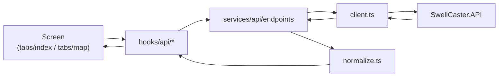

# Swell Caster Native — App Architecture

Native-specific layers and conventions. For API behaviour, spot ratings, and database design, see **SwellCaster.API** docs (`../SwellCaster.API/docs/README.md`).

---

## Stack

| Layer | Technology |
| ----- | ---------- |
| Framework | Expo SDK 54, React Native, Expo Router (native tabs) |
| Language | TypeScript |
| Auth | Clerk (`@clerk/expo`) — optional sign-in, bearer token on API requests |
| Server state | TanStack Query v5 |
| Client state | Zustand (`selected-location-store`, `theme-store`) |
| HTTP | Axios via `services/api/client.ts` |
| Location | `expo-location` via `useDeviceLocation` |
| Maps | `react-native-maps` (`components/map/surf-map.tsx`) |

---

## Directory map

```text
native/src/
├── app/
│   ├── _layout.tsx              # ClerkProvider, fonts, QueryProvider, root stack
│   ├── sign-in.tsx              # OAuth sign-in screen
│   └── (tabs)/
│       ├── _layout.tsx          # Native tab bar (Home / Map)
│       ├── index.tsx            # Home — GPS/search forecast
│       └── map.tsx              # Map — spot markers, video, forecast panel
│
├── services/
│   ├── api/                     # Backend integration
│   │   ├── config.ts            # Base URL (Metro proxy on device)
│   │   ├── client.ts            # Axios + Clerk bearer token
│   │   ├── endpoints.ts         # swellApi, videosApi
│   │   ├── normalize.ts         # Response normalization
│   │   └── types.ts             # Types matching C# models
│   └── auth/
│       └── auth-token.ts        # Clerk token getter registration
│
├── providers/
│   ├── query-provider.tsx       # TanStack Query defaults
│   └── auth-token-sync.tsx      # Registers Clerk getToken with API client
│
├── hooks/
│   ├── api/
│   │   ├── use-forecast.ts      # Full forecast (current + hourly + daily)
│   │   └── use-condition-videos.ts
│   ├── use-curated-spots.ts
│   ├── use-curated-spot-conditions.ts
│   ├── use-map-spot-markers.ts
│   ├── use-device-location.ts
│   └── use-day-overview.ts
│
├── components/
│   ├── forecast/                # Daily cards, hourly detail, location sections
│   ├── charts/                  # Wave height, tide, line charts
│   ├── map/                     # SurfMap, markers, selection pin
│   ├── condition-video/         # Record + player
│   ├── auth/                    # User account button
│   └── ui/                      # Shared forecast UI primitives
│
├── stores/
│   ├── selected-location-store.ts
│   └── recent-location-search-store.ts
│
└── utils/
    ├── surf-height.ts           # Display conversions + swell reach
    ├── tide.ts                  # Tide chart helpers (API sea level)
    ├── spot-quality.ts          # Generic coastal rating fallback
    ├── forecast.ts              # Rating colors, labels
    ├── day-overview.ts          # Outlook bullet generation
    ├── daily-hourly-forecast.ts
    └── coordinates.ts           # Curated spot matching
```

---

## Data flow (native only)



Screens never call axios directly — always go through hooks → `swellApi` / `videosApi`.

The native app does **not** call Open-Meteo or any third-party surf forecast service directly. All marine data comes from SwellCaster.API.

---

## Screens

### Home (`app/(tabs)/index.tsx`)

1. Resolve location: Zustand manual coords **or** `useDeviceLocation` GPS
2. Match coords to curated spot name via `useCuratedSpots`
3. Fetch `useForecast({ lat, lon, days })`
4. Render `LocationForecastSections` — primary conditions, charts, daily/hourly outlook

### Map (`app/(tabs)/map.tsx`)

1. Load all spot markers via `useMapSpotMarkers` (conditions + spot metadata)
2. Load active video pins via condition video hooks
3. On marker tap → fetch forecast for selected coords + optional video at location
4. `RecordConditionVideoButton` uploads from user's GPS at the break

---

## API hooks reference

| Hook | Endpoint | Stale time |
| ---- | -------- | ---------- |
| `useForecast` | `/api/swell/forecast` | 15 min |
| `useCuratedSpotConditions` | `/api/places/spots/conditions` | 15 min |
| `useCuratedSpots` | `/api/places/spots` | 30 min |
| `useConditionVideoAt` | `/api/videos/at` | 5 min |
| `useActiveConditionVideos` | `/api/videos/active` | 5 min |

Lower-level `/api/swell/current`, `/hourly`, and `/daily` exist on the API but the app uses the combined forecast endpoint only.

Query client defaults (`providers/query-provider.tsx`): 5 min stale, 15 min GC, 1 retry, no refetch on focus.

---

## Dev API URL

Resolved in `services/api/config.ts`:

| Environment | URL |
| ----------- | --- |
| Simulator/emulator | `http://localhost:5213` |
| Physical device | `http://<mac-ip>:8081` (Metro proxies to API) |
| Override | `EXPO_PUBLIC_API_URL` in `.env` |

Proxy implementation: `metro.config.js` at project root.

### Auth env

Clerk requires `EXPO_PUBLIC_CLERK_PUBLISHABLE_KEY` in `native/.env` (gitignored). See root layout error message if missing.

---

## Testing

```bash
npm test                  # Jest — utils, API endpoints
npm test -- --coverage
```

Tests mock axios at the API boundary. Key suites:
- `services/api/__tests__/endpoints.test.ts`
- `utils/__tests__/*.test.ts`
- `hooks/__tests__/api-rate-limits.test.ts`

---

## Related docs

| Doc | Topic |
| --- | ----- |
| [QUICKSTART.md](./QUICKSTART.md) | Run API + app locally |
| [docs/FORECAST_UI.md](./docs/FORECAST_UI.md) | Forecast screen components |
| [docs/SURF_FORECAST_VIDEOS.md](./docs/SURF_FORECAST_VIDEOS.md) | Video recording UX |
| [SURF_HEIGHT.md](./SURF_HEIGHT.md) | Surf height display logic |
| [../SwellCaster.API/docs/README.md](../SwellCaster.API/docs/README.md) | API docs index |
