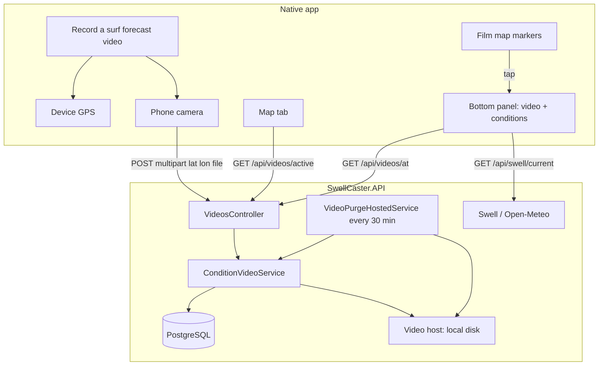

# Surf forecast videos

Crowdsourced **live surf forecast videos** pinned to GPS coordinates on the map. Users film conditions at any break — including spots not in our database — so others can see what it actually looks like before they go.

This feature stores crowdsourced clips on the **API disk** (`Uploads/videos/`) and serves them to the native app map.

---

## Product overview

| Goal | How it works |
| ---- | ------------ |
| No fixed webcams | Anyone at the coast records from their phone |
| Unknown / new breaks | Video attaches to **GPS lat/lon**, not a curated spot list |
| Discover on map | **Film icons** show where active videos exist |
| Fresh conditions | Videos **expire after 12 hours**; a newer upload replaces the old one nearby |
| Watch + forecast | Tap a film icon → **video + swell/wind conditions** in the bottom panel |

---

## User flows

### Recording a video

1. Open the **Map** tab.
2. Enable **location permission** for Expo Go.
3. Stand where you want to film (any coastal location).
4. Tap **Record a surf forecast video** in the bottom panel.
5. Allow **camera** access, record up to **60 seconds**.
6. Upload sends your **current GPS coordinates** to the API — not where you tapped on the map.

The button is **disabled** until location is available. When enabled, it shows your pin label (spot name if near a curated break, otherwise formatted coordinates).

### Watching a video

1. Open the **Map** tab.
2. Look for **film icons** (dark circle with video symbol) on the map.
3. **Tap a film icon** — the map zooms to that pin.
4. The bottom panel shows:
   - **Video player** (top)
   - **Conditions** for that location (swell, wind, rating badge)
   - **Use for home forecast** to set that location on the home screen

**Coloured dots** = curated surf spots with forecast ratings.  
**Film icons** = live user videos. They are separate markers; tap the film icon specifically to watch video.

There is **no** auto-playing “live video here” panel when you open the map — you choose a film icon first.

---

## System architecture



---

## Location model

### Recording uses GPS only

Upload always sends the device’s **live GPS** (`userCoords` from `useDeviceLocation`). The map selection pin does not affect upload coordinates.

### Anywhere on the coast

The API **does not require** a curated spot in the database. If GPS happens to match a known spot (~0.02° tolerance), the video links to that spot for convenience; otherwise `SpotId` is null and the video is stored purely by lat/lon.

### Match radius (~400 m)

Videos are grouped by proximity:

- **Upload** replaces any existing active video within **400 m** of the new coordinates.
- **Lookup** (`GET /api/videos/at`) returns the nearest active video within **400 m**.

Configured in API `Videos:LocationMatchRadiusMeters` (default `400`).

### TTL (12 hours)

Each video has `ExpiresAtUtc = CreatedAtUtc + 12 hours`. A background service runs every **30 minutes** and deletes expired videos from disk and the database.

---

## Map UI

### Marker types

| Marker | Component | Meaning |
| ------ | --------- | ------- |
| Coloured glowing dot | `SurfMapMarker` | Curated spot; colour = surf rating (bad → amazing) |
| Dark film icon | `VideoMapMarker` | Active condition video at that GPS point |
| Blue pin | `MapSelectionPin` | Generic map tap (search or empty ocean); not used for video selection |

Every active video from `GET /api/videos/active` renders as a **film icon**, including videos near curated spots (film markers render above spot dots with higher `zIndex`).

### Bottom panel states

| State | Panel content |
| ----- | ------------- |
| Nothing selected | Hint text + record button |
| Film icon tapped | Video player + conditions + actions |
| Coloured dot tapped | Conditions only (no video unless you also tap a film icon at that location) |
| Map/search tap | Conditions for those coordinates |

---

## API reference

Base path: `/api/videos`

| Method | Route | Description |
| ------ | ----- | ----------- |
| `GET` | `/active` | All non-expired videos — used to draw film icons |
| `GET` | `/at?lat=&lon=` | Nearest active video within match radius; `404` if none |
| `POST` | `/` | Multipart upload: `file`, `lat`, `lon` |

### Upload request

```http
POST /api/videos
Content-Type: multipart/form-data

file=<video.mp4>
lat=-26.6700
lon=153.1000
```

**Limits:** 100 MB max, MP4/MOV, max ~60 s (enforced client-side).

**Success:** `200` with `ConditionVideo` JSON (includes `embedUrl`, `expiresAtUtc`).

**Errors:** `400` with `{ "error": "..." }` for validation failures.

### ConditionVideo fields (app types)

```typescript
interface ConditionVideo {
  id: string;
  spotId?: string | null;   // optional link to curated spot
  spotName?: string;
  lat: number;
  lon: number;
  provider: 'local' | string;
  providerVideoId: string;
  embedUrl: string;
  thumbnailUrl?: string;
  createdAtUtc: string;
  expiresAtUtc: string;
}
```

---

## Native app implementation

### Key files

| Path | Role |
| ---- | ---- |
| `src/app/(tabs)/map.tsx` | Map screen: selection state, panel, record section |
| `src/components/map/surf-map.tsx` | MapView, spot markers, film markers, tap handlers |
| `src/components/map/video-map-marker.tsx` | Film icon UI |
| `src/components/condition-video/record-condition-video-button.tsx` | Camera + upload |
| `src/components/condition-video/condition-video-player.tsx` | Local MP4 via expo-video |
| `src/hooks/api/use-condition-videos.ts` | `useActiveConditionVideos`, `useConditionVideoAt` |
| `src/services/api/endpoints.ts` | `videosApi.getActive`, `getAt`, `upload` |
| `src/hooks/use-device-location.ts` | GPS for recording |

### Data fetching

- **Film icons:** `useActiveConditionVideos()` — refetches every 5 minutes; invalidated after upload.
- **Panel video:** `useConditionVideoAt(selectedCoords)` when a film icon is selected.
- **Panel conditions:** `useCurrent(selectedCoords)` or curated spot conditions from `useMapSpotMarkers`.

### Selection state (`map.tsx`)

```typescript
selectedCoords    // lat/lon of map selection
selectedLabel     // spot name, "Live surf video", or search label
selectedIsSpot    // true when a coloured dot was tapped
selectedIsVideo   // true when a film icon was tapped
```

Film icon tap calls `handleSelectVideo(video)` which sets coords from the video record and shows the player in the panel.

---

## Video hosting

Videos are stored on the API server under `Uploads/videos/` and served at `/uploads/videos/{id}.mp4`.

```bash
cd SwellCaster.API
dotnet run --launch-profile http
```

Metro proxies `/uploads/*` to the API during phone dev so clips play in the app.

---

## Development checklist

1. **API running** on port `5213` (`dotnet run --launch-profile http`).
2. **Native app** via `npm run start:phone` — Metro proxies `/api/*` and `/uploads/*` to the Mac.
3. **Location + camera** enabled on the phone for Expo Go.
4. Record a short clip on the **Map** tab → film icon should appear after upload.
5. Tap the film icon → video and conditions in the bottom panel.

### Restarting the API safely

Only one process should bind port **5213**:

```bash
lsof -i :5213 -t | xargs kill
cd ~/Documents/dev/swell-caster/SwellCaster.API
dotnet run --launch-profile http
```

If you see `Address already in use`, the previous API instance is still running.

---

## Troubleshooting

| Symptom | Likely cause | Fix |
| ------- | ------------- | --- |
| Upload failed: “curated surf spot” | Old API binary still running | Kill port 5213 and restart API |
| Record button disabled | Location off or still loading | Enable location for Expo Go; wait for GPS |
| No film icon after upload | Query cache / map not refreshed | Reload app (`r`); check API logs for POST success |
| Video won’t play (local) | Wrong base URL for `/uploads` | Ensure phone reaches API via Metro proxy |
| 502 on phone | API not running | Start `dotnet run` in API folder |
| Film icon tap, no video in panel | Video expired or coords outside 400 m | Record again at that location |

---

## Related documentation

- [QUICKSTART.md](../QUICKSTART.md) — full local dev setup
- [SwellCaster.API/docs/VIDEOS.md](../../SwellCaster.API/docs/VIDEOS.md) — API upload flow, hosting, purge
- [SwellCaster.API/docs/DATABASE.md](../../SwellCaster.API/docs/DATABASE.md) — `condition_videos` schema and migrations
- [CONDITION_VIDEOS.md](../../SwellCaster.API/CONDITION_VIDEOS.md) — API config
- [ARCHITECTURE.md](../ARCHITECTURE.md) — native app structure
